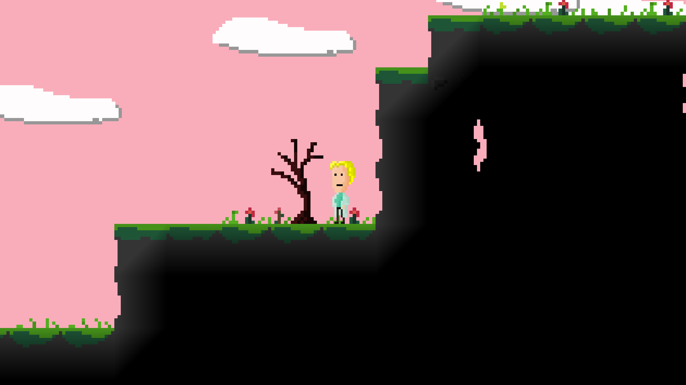

# Maybe-a-Game
I made a thing! ...and had fun drawing the tiles, creating the map and looking for sounds and music. Unfortunately, I have no idea what to do with it now, so I'll just upload it as is.

## Features
- Explore the map
- Destroy blocks
- Pick up items

## Controls
Function|Key
-|-
Movement|wasd
Jump|space
Inventory|i
Hit block|left mouse, x

## Building Project
Install SFML and cmake. Then follow commands in make.sh.
